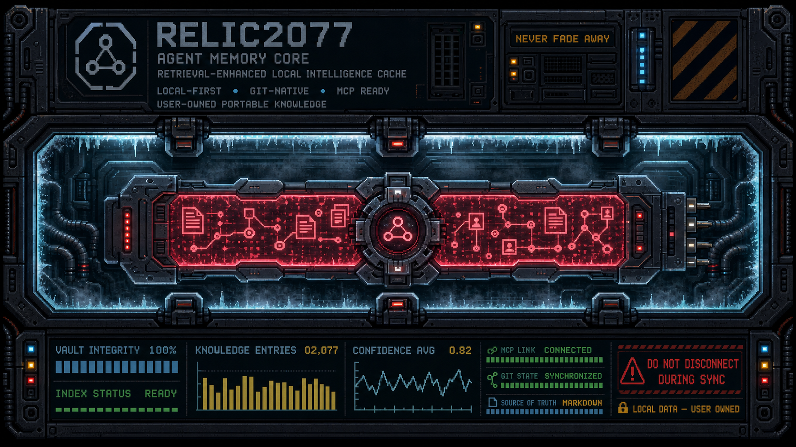

<div align="center">

# Relic2077

### Retrieval-Enhanced Local Intelligence Cache

**English** | [简体中文](README.zh-CN.md)



>Secure Your Soul

---

Relic2077 is a local-first, Git-native intelligence hub that preserves 

a single continuity of memory as AI agent tools rapidly evolve 

and compete to become the user's primary interface. 

It gives Codex, Claude, Cursor, DeepSeek Harness (DSH), and other MCP-compatible agents 

a unified memory that is fully owned by the user,

without locking personal knowledge to any model or vendor.

Markdown is the source of truth; SQLite is only a disposable search index. 

Your knowledge remains readable, portable, rebuildable, and yours.

</div>

## Current milestone

This repository contains the Phase 0 CLI plus the first MCP integration:

- initialize a portable vault with a documented schema;
- create, read, list, and full-text search knowledge entries;
- organize knowledge, patterns, decisions, sources, attachments, and reflections;
- generate daily, weekly, or monthly reflection drafts;
- rebuild the entire SQLite FTS5 index from Markdown at any time;
- validate vault health with `relic doctor`.
- expose the vault to Codex, Claude, Cursor, and other agents through a local
  STDIO MCP server.

Git synchronization, confidence evolution, remote MCP transport, and specialized
agent adapters remain future milestones. The storage format is already compatible
with them.


## Install

```bash
cargo install --path .
```

This installs a single command named `relic`.

## Quick start

```bash
relic init ~/relic-vault
cd ~/relic-vault

relic add "RAG chunking strategy" \
  --content "Use 512–1024 token chunks for prose; validate against the corpus." \
  --tags rag,chunking \
  --confidence 0.82 \
  --source-agent codex

relic search "chunking"
relic update <entry-id> --confidence 0.9 --tags rag,verified
relic supersede <old-entry-id> <new-entry-id>
relic list --status active
relic reflect --period weekly
relic stats
relic doctor
```

## Connect an agent through MCP

Build the release binary and initialize a vault:

```bash
cargo build --release
./target/release/relic init ~/relic-vault
```

Relic's MCP server uses standard input/output and never opens a network port:

```bash
./target/release/relic mcp --vault ~/relic-vault
```

Add it to Codex:

```bash
codex mcp add relic -- \
  /absolute/path/to/Relic2077/target/release/relic \
  mcp --vault /absolute/path/to/relic-vault --source-agent codex
```

Or add a project-scoped `.codex/config.toml`:

```toml
[mcp_servers.relic]
command = "/absolute/path/to/Relic2077/target/release/relic"
args = ["mcp", "--vault", "/absolute/path/to/relic-vault", "--source-agent", "codex"]
required = true
default_tools_approval_mode = "writes"
```

### Claude Code

Register Relic for the current project:

```bash
claude mcp add --transport stdio --scope project relic -- \
  /absolute/path/to/Relic2077/target/release/relic \
  mcp --vault /absolute/path/to/relic-vault --source-agent claude-code
```

Run `/mcp` inside Claude Code to review and approve the project server. Use
`--scope user` instead if you want the same vault available in every project.

### Cursor

Add `.cursor/mcp.json` to the project, or use `~/.cursor/mcp.json` globally:

```json
{
  "mcpServers": {
    "relic": {
      "command": "/absolute/path/to/Relic2077/target/release/relic",
      "args": ["mcp", "--vault", "/absolute/path/to/relic-vault", "--source-agent", "cursor"]
    }
  }
}
```

Open **Cursor Settings > MCP** to enable `relic` and inspect its tools. Cursor
CLI uses the same configuration; run `agent mcp list` to check the connection.

### Gemini CLI

Add the server to the top-level `mcpServers` object in `.gemini/settings.json`
for the current project, or `~/.gemini/settings.json` globally:

```json
{
  "mcpServers": {
    "relic": {
      "command": "/absolute/path/to/Relic2077/target/release/relic",
      "args": ["mcp", "--vault", "/absolute/path/to/relic-vault", "--source-agent", "gemini-cli"]
    }
  }
}
```

Start or reload Gemini CLI, then run `/mcp` to verify the server and its tools.

### VS Code and GitHub Copilot

Add `.vscode/mcp.json` to the workspace:

```json
{
  "servers": {
    "relic": {
      "type": "stdio",
      "command": "/absolute/path/to/Relic2077/target/release/relic",
      "args": ["mcp", "--vault", "/absolute/path/to/relic-vault", "--source-agent", "github-copilot"]
    }
  }
}
```

Run **MCP: List Servers** from the Command Palette, start `relic`, and accept
the workspace trust prompt. A portable Agent Host configuration can instead be
stored in the workspace root as `.mcp.json`.

### DeepSeek Harness (DSH)

DSH connects to local MCP servers through its official
`@deepseek-ai/dsh-mcp-client`. Add this entry to the top-level array in your
profile's `cordis.patch.yml` (normally
`$DSH_HOME/profiles/<profile>/cordis.patch.yml`; `$DSH_HOME` defaults to
`~/.dsh`):

```yaml
- insert:
    - id: mcp-relic
      name: '@deepseek-ai/dsh-mcp-client'
      config:
        transport: stdio
        serverName: relic
        command: /absolute/path/to/Relic2077/target/release/relic
        args:
          - mcp
          - --vault
          - /absolute/path/to/relic-vault
          - --source-agent
          - dsh
```

Start or reload DSH, then run `/mcp` to verify that the `relic` server exposes
eight tools. The `--source-agent dsh` option attributes entries created without
an explicit `source_agent` to DeepSeek Harness.

The server publishes eight tools: `relic_search`, `relic_get_entry`,
`relic_list_entries`, `relic_create_entry`, `relic_update_entry`,
`relic_supersede_entry`, `relic_create_reflection`, and `relic_get_stats`.
Read-only and write operations carry MCP tool annotations so compatible clients
can apply appropriate approval policies.

## Principles

1. **Plain text owns the truth.** The database can always be deleted and rebuilt.
2. **History beats deletion.** Superseded knowledge stays available to Git and future reflection.
3. **Confidence is explicit.** Entries state how certain and how fresh they are.
4. **Agents are replaceable.** The vault is not coupled to any model or vendor.

## Layout

```text
.relic/          configuration, schema, and disposable local index
entries/         core knowledge
reflections/     daily, weekly, and monthly reviews
patterns/        reusable patterns extracted from multiple entries
decisions/       ADR-style decisions
sources/         original references and conversations
attachments/     images and files
AGENTS.md         instructions for any agent entering the vault
```

## Roadmap

- **0.2:** update/supersede CLI commands, decay calculation, richer filters
- **0.3:** streamable HTTP MCP transport and optional authentication
- **0.4:** Git synchronization and conflict resolution
- **0.5:** reflection triggers, contradiction detection, and pattern extraction
- **1.0:** stable storage schema, adapters, daemon, and multi-device workflow
